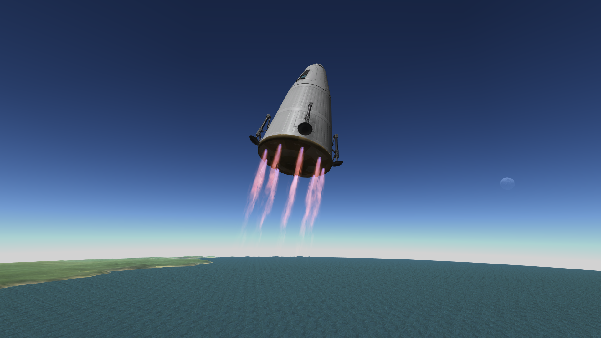
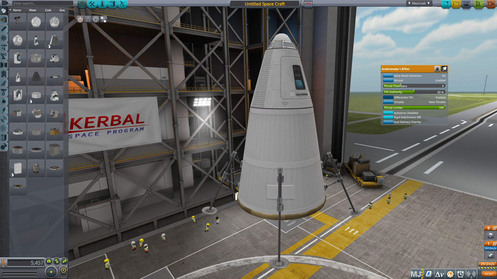
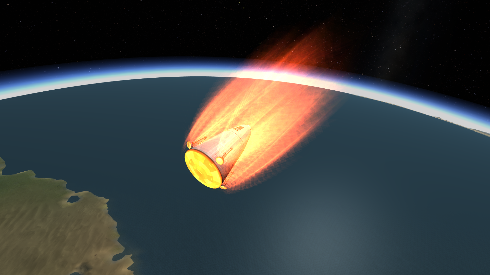
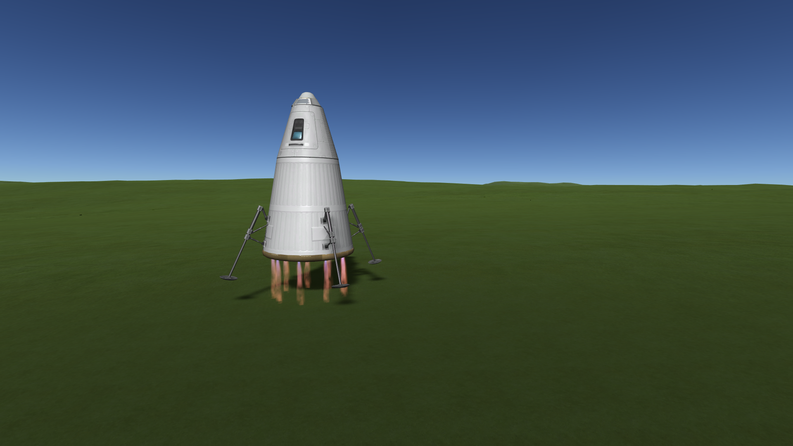

# Stoke Engine

A Kerbal Space Program mod adding reusable-style second-stage engines inspired by [Stoke Space's](https://www.stokespace.com/) Andromeda. Each part is a heatshield with a ring of thrust chambers around its perimeter — thrust vector control is achieved by differentially throttling the chambers instead of gimbaling a nozzle.

## Gallery

## Features

- **Five diameter variants**: 1.25m, 1.875m, 2.5m, 3.75m, 5m
- **Modular chamber count**: 3–24 thrust chambers per engine, adjustable in the VAB
- **Differential-throttle TVC**: no gimbal — attitude control comes from varying individual chamber throttles
- **Integrated heatshield**: the engine itself acts as a reentry shield (high skin temperature tolerance)
- **MechJeb-compatible**: reports torque authority correctly, works with ascent/landing guidance
- **Waterfall plume effects**: per-chamber plumes with atmospheric pressure response

## Design philosophy

Differential-throttle engines have fundamentally different handling characteristics than gimbaled ones. Authority is lower, response is slower, and there is **no roll authority at all** — you must provide roll via reaction wheels or RCS. This is intentional. The mod trades conventional responsiveness for the Stoke-style aesthetic and the gameplay discipline it demands.

## Installation

### Via CKAN
_(Not yet listed — coming soon)_

### Manual
1. Download the latest release zip
2. Extract the `GameData/` folder into your KSP install
3. Verify `GameData/StokeEngine/` exists

## Dependencies

Required:
- [Module Manager](https://forum.kerbalspaceprogram.com/topic/50533-module-manager/) 4.2.3+
- [B9PartSwitch](https://github.com/blowfishpro/B9PartSwitch) 2.20+
- [Waterfall](https://github.com/post-kerbin-mining-corporation/Waterfall) 0.10+

Recommended:
- [Stock Waterfall Effects](https://github.com/KnightofStJohn/StockWaterfallEffects) — the Andromeda's plume template comes from this mod

## Known limitations

- No roll authority from the engine (by design — add reaction wheels)
- Uses stock heatshield models for visuals (custom model planned for v0.2+)
- 1.875m and 5m variants are rescaled stock heatshields; proportions may look slightly off
- No RealFuels support yet (planned for v0.2)
- Per-chamber plume variation not yet implemented (all chambers render identical plumes regardless of per-chamber thrust)

## Compatibility

- KSP 1.12.x
- Tested with: Stock, Stock Waterfall Effects, MechJeb
- Untested with: RealFuels, Deadly Reentry, FAR

## Contributing

Issues and PRs welcome. This is an early mod; expect rough edges.

## Credits

- Based on [Stoke Space Andromeda](https://www.stokespace.com/introducing-andromeda/) engine design
- Plume templates from Stock Waterfall Effects
- Stock heatshield models by Squad

## License

CC-BY-NC-SA 4.0 — see `LICENSE` for details.

## Changelog

### v0.1 (unreleased)
- Initial release
- Five diameter variants
- Differential-throttle TVC with MechJeb compatibility
- Waterfall plume integration
